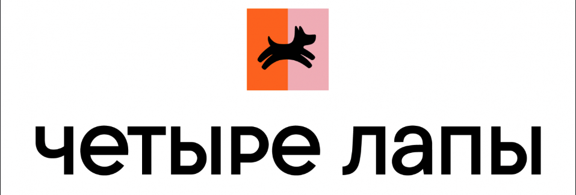
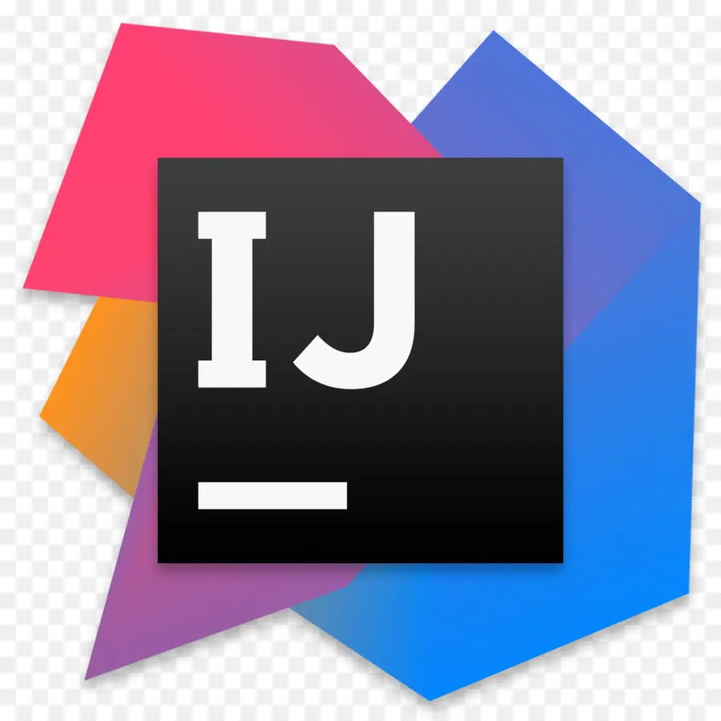
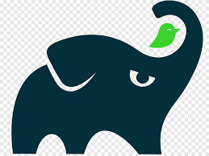
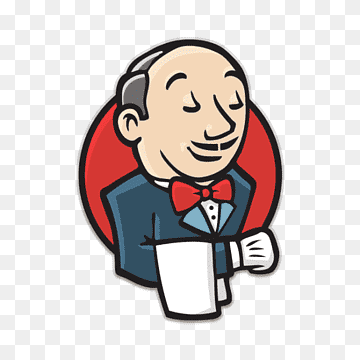

# Проект с автотестами на Java для комании Четыре лапы

>Четыре лапы - сеть зоомагазинов с разнообразными товарами для питомцев, а также онлайн и оффлайн петсервисы. 
 
Автотесты разработаны для [веб-сайта компании](https://4lapy.ru/) 

## Содержание

- [Стэк]()
- [Примеры автоматизированных тест-кейсов]()
- [Сборка в Jenkins]()
- [Запуск из терминала]()
- [Allure отчет]()
- [Уведомление в Telegram при помощи бота]()
- [Примеры видео выполнения тестов на Selenoid]()

## Стэк:

## Примеры автоматизированных тест-кейсов: