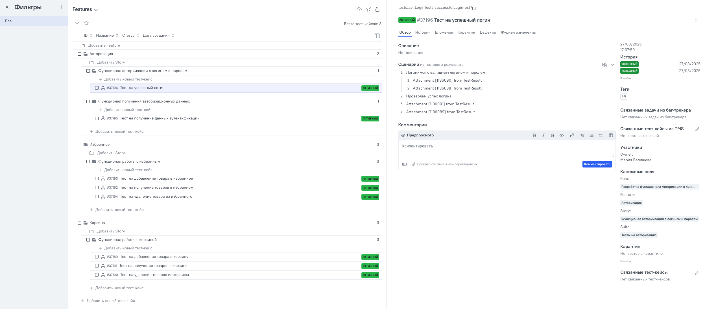
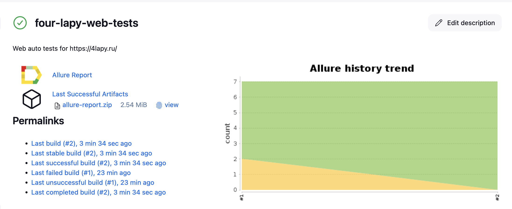
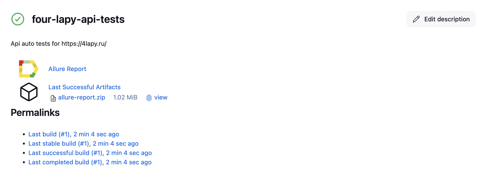
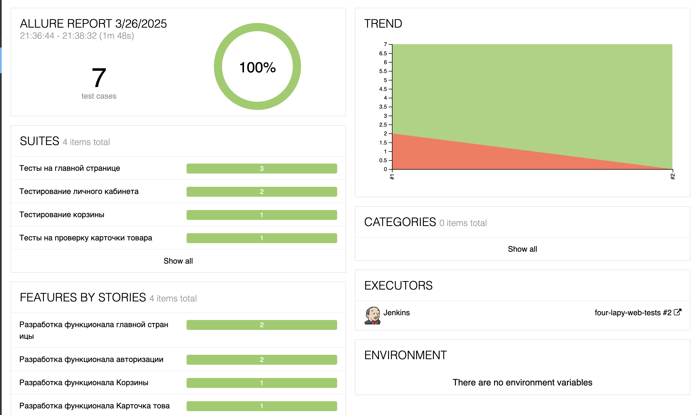
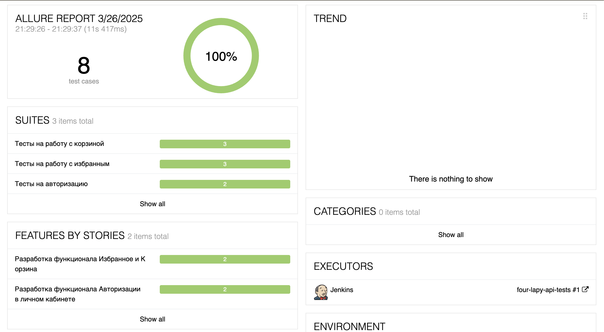
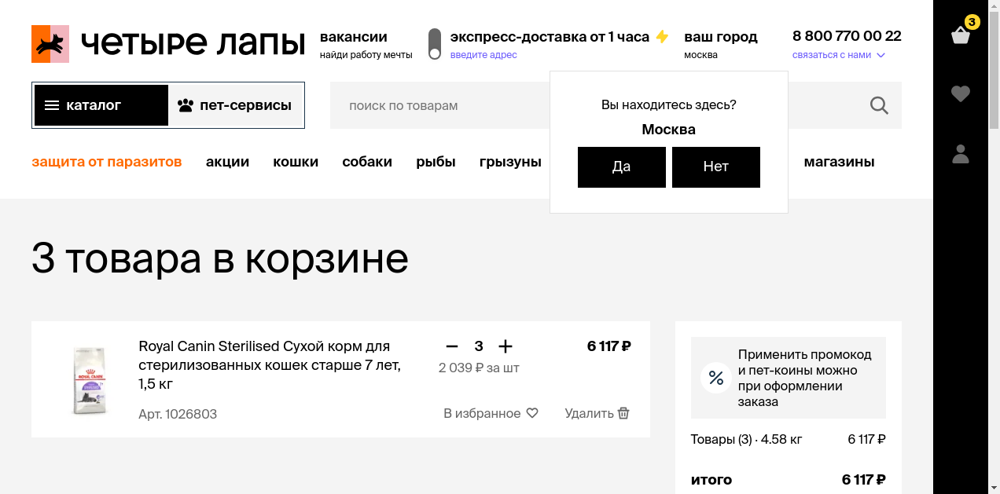
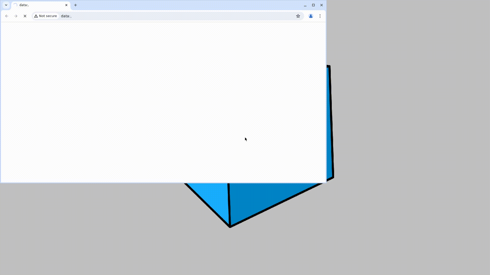

# Проект с автотестами на Java для комании Четыре лапы


> Четыре лапы - сеть зоомагазинов с разнообразными товарами для питомцев, а также онлайн и оффлайн петсервисами.

Автотесты разработаны для [веб-сайта компании](https://4lapy.ru/)

## Содержание

- [Стэк](https://github.com/Mariia-Valisheva/4lapy-auto-tests?tab=readme-ov-file#%D1%81%D1%82%D1%8D%D0%BA)
- [Автоматизированные тест-кейсы](https://github.com/Mariia-Valisheva/4lapy-auto-tests?tab=readme-ov-file#%D0%BF%D1%80%D0%B8%D0%BC%D0%B5%D1%80%D1%8B-%D0%B0%D0%B2%D1%82%D0%BE%D0%BC%D0%B0%D1%82%D0%B8%D0%B7%D0%B8%D1%80%D0%BE%D0%B2%D0%B0%D0%BD%D0%BD%D1%8B%D1%85-%D1%82%D0%B5%D1%81%D1%82-%D0%BA%D0%B5%D0%B9%D1%81%D0%BE%D0%B2)
- [Интеграция с Allure TestOps и ручные тест-кейсы](https://github.com/Mariia-Valisheva/4lapy-auto-tests?tab=readme-ov-file#writing_hand-%D0%B8%D0%BD%D1%82%D0%B5%D0%B3%D1%80%D0%B0%D1%86%D0%B8%D1%8F-%D1%81-allure-testops-%D0%B8-%D1%80%D1%83%D1%87%D0%BD%D1%8B%D0%B5-%D1%82%D0%B5%D1%81%D1%82-%D0%BA%D0%B5%D0%B9%D1%81%D1%8B)
- [Web сборка в Jenkins](https://github.com/Mariia-Valisheva/4lapy-auto-tests?tab=readme-ov-file#label-web-%D1%81%D0%B1%D0%BE%D1%80%D0%BA%D0%B0-%D0%B2-jenkins)
- [Api сборка в Jenkins](https://github.com/Mariia-Valisheva/4lapy-auto-tests?tab=readme-ov-file#label-api-%D1%81%D0%B1%D0%BE%D1%80%D0%BA%D0%B0-%D0%B2-jenkins)
- [Команды для запуска сборки](https://github.com/Mariia-Valisheva/4lapy-auto-tests?tab=readme-ov-file#%D0%BA%D0%BE%D0%BC%D0%B0%D0%BD%D0%B4%D1%8B-%D0%B4%D0%BB%D1%8F-%D0%B7%D0%B0%D0%BF%D1%83%D1%81%D0%BA%D0%B0-%D1%81%D0%B1%D0%BE%D1%80%D0%BA%D0%B8-%D0%B8%D0%B7-%D1%82%D0%B5%D1%80%D0%BC%D0%B8%D0%BD%D0%B0%D0%BB%D0%B0)
- [Allure отчет](https://github.com/Mariia-Valisheva/4lapy-auto-tests?tab=readme-ov-file#allure-%D0%BE%D1%82%D1%87%D0%B5%D1%82-%D1%81%D1%84%D0%BE%D1%80%D0%BC%D0%B8%D1%80%D1%83%D0%B5%D1%82%D1%81%D1%8F-%D0%B4%D0%BB%D1%8F-%D0%BA%D0%B0%D0%B6%D0%B4%D0%BE%D0%B9-%D1%81%D0%B1%D0%BE%D1%80%D0%BA%D0%B8)
- [Уведомление в Telegram ](https://github.com/Mariia-Valisheva/4lapy-auto-tests?tab=readme-ov-file#%D0%BF%D0%BE%D1%81%D0%BB%D0%B5-%D0%B2%D1%8B%D0%BF%D0%BE%D0%BB%D0%BD%D0%B5%D0%BD%D0%B8%D1%8F-%D1%81%D0%B1%D0%BE%D1%80%D0%BA%D0%B8-%D0%B2-%D1%82%D0%B5%D0%BB%D0%B5%D0%B3%D1%80%D0%B0%D0%BC-%D0%B1%D0%BE%D1%82-%D0%BF%D1%80%D0%B8%D0%B4%D0%B5%D1%82-%D0%BE%D1%82%D1%87%D0%B5%D1%82)
- [Видео запуска теста](https://github.com/Mariia-Valisheva/4lapy-auto-tests?tab=readme-ov-file#%D0%B4%D0%BB%D1%8F-%D0%BA%D0%B0%D0%B6%D0%B4%D0%BE%D0%B3%D0%BE-%D1%82%D0%B5%D1%81%D1%82%D0%B0-%D1%81%D0%BE%D1%85%D1%80%D0%B0%D0%BD%D0%B8%D1%82%D1%81%D1%8F-%D1%81%D0%BA%D1%80%D0%B8%D0%BD%D1%88%D0%BE%D1%82-%D0%B8-%D0%B2%D0%B8%D0%B4%D0%B5%D0%BE-%D1%81-%D1%80%D0%B5%D0%B7%D1%83%D0%BB%D1%8C%D1%82%D0%B0%D1%82%D0%BE%D0%BC)

## :floppy_disk: Стэк:

<p align="center">  
<a href="https://www.jetbrains.com/idea/"></a>  
<a href="https://www.java.com/"></a>  
<a href="https://github.com/"></a>  
<a href="https://junit.org/junit5/"></a>  
<a href="https://gradle.org/"></a>  
<a href="https://selenide.org/"></a>  
<a href="https://aerokube.com/selenoid/"></a>
<a href="https://allurereport.org/"></a>
<a href="https://www.jenkins.io/"></a>  
<a href="https://rest-assured.io/"></a>  
<a href="https://qameta.io/"></a>  
</p>

Тесты написаны на языке Java с использованием фреймворков Selenide, JUnit5 и системы сборки Gradle. В api-тестах
используется библиотека Rest Assured. Для параметризации сборки используется библиотека Owner.

В качестве TMS системы настроена интеграция с Allure TestOps, куда также добавлены ручные тест-кейсы. 

CI/CD проходит через Jenkins, тесты запускаются на Selenoid. Тестовая отчетность формируется в Allure Reports. После
завершения прогона отправляются уведомления с помощью бота в Telegram.

## :computer: Автоматизированные тест-кейсы:

### Web-тесты
- [x] Проверка поиска по ключевому слову на главной странице
- [x] Проверка поиска по каталогу
- [x] Проверка выбора локации на главной странице
- [x] Проверка добавления товара в корзину
- [x] Проверка отображения отзывов в карточке товара
- [x] Проверка авторизации через валидный email
- [x] Проверка уведомления при введении некорректного проверочного кода (для авторизации по номеру телефона)

### Api-тесты:
- [x] Проверка получения токенов для авторизации
- [x] Проверка авторизации с валидными данными
- [x] Проверка добавления/удаления товара из корзины
- [x] Проверка добавления/удаления товара из избранного
- [x] Проверка на просмотр содержимого корзины
- [x] Проверка на просмотр содержимого в избранном

## :writing_hand: Интеграция с Allure TestOps и ручные тест-кейсы:
### Web-тесты

Ручные тест-кейсы отмечены статусом "Черновик"

#### Примеры ручных тест-кейсов: 
- [x] Проверка авторизации с валидным номером телефона и валидным проверочным кодом
- [x] Проверка невозможности оформить заказ неавторизированным пользователем
- [x] Проверка оформления заказа авторизированным пользователем 

### Api-тесты:



## :label: Web сборка в [Jenkins](https://jenkins.autotests.cloud/job/four-lapy-tests/):



**Сборку можно собрать с параметрами:**

* <code>BROWSER</code> – браузер для выполнения тестов
* <code>BROWSER_SIZE</code> – размер окна браузера
* <code>BROWSER_VERSION</code> – версия браузера (в зависимости от выбранного браузера)
* <code>TEST_SUIT</code> – запускаемый тестовый набор
* <code>SELENOID_HOST</code> – адрес удаленного сервера для запуска тестов
* <code>BASE_URL</code> – вызываемый урл
* <code>ENVIRONMENT</code> – окружение для запуска тестов
* <code>COMMENT</code> – комментарий для отчета в тг

## :label: Api сборка в [Jenkins](https://jenkins.autotests.cloud/job/four-lapy-tests/):


**Сборку можно собрать с параметрами:**
* <code>TEST_SUIT</code> – запускаемый тестовый набор
* <code>ENVIRONMENT</code> – окружение для запуска тестов
* <code>COMMENT</code> – комментарий для отчета в тг
* <code>BASE_URI</code> – адрес вызываемого сервера

### Команды для запуска сборки из терминала:

**Сборка на удаленном Selenoid с параметрами, указанными в конфигурационном файле:**

```
gradle clean fourlapy_webtests -Denv=remote
```

**Локальная сборка с параметрами, указанными в конфигурационном файле:**

```
gradle clean fourlapy_webtests -Denv=local
```

**Локальная сборка с параметрами api тестов:**

```
gradle clean fourlapy_apitests
```

## :page_facing_up: [Allure отчет](https://jenkins.autotests.cloud/job/four-lapy-tests/3/allure/) сформируется для каждой сборки:





### После выполнения сборки в телеграм-бот придет отчет:

<p align="center">
   
</p>

### Для каждого теста сохранится скриншот и видео с результатом:



<p align="center">
   
</p>


