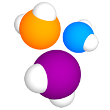

# Проект с автотестами на Java для комании Четыре лапы


>Четыре лапы - сеть зоомагазинов с разнообразными товарами для питомцев, а также онлайн и оффлайн петсервисами. 
 
Автотесты разработаны для [веб-сайта компании](https://4lapy.ru/) 

## Содержание

- [Стэк](https://github.com/Mariia-Valisheva/4lapy-auto-tests?tab=readme-ov-file#%D1%81%D1%82%D1%8D%D0%BA)
- [Примеры автоматизированных тест-кейсов](https://github.com/Mariia-Valisheva/4lapy-auto-tests?tab=readme-ov-file#%D0%BF%D1%80%D0%B8%D0%BC%D0%B5%D1%80%D1%8B-%D0%B0%D0%B2%D1%82%D0%BE%D0%BC%D0%B0%D1%82%D0%B8%D0%B7%D0%B8%D1%80%D0%BE%D0%B2%D0%B0%D0%BD%D0%BD%D1%8B%D1%85-%D1%82%D0%B5%D1%81%D1%82-%D0%BA%D0%B5%D0%B9%D1%81%D0%BE%D0%B2)
- [Сборка в Jenkins]()
- [Запуск из терминала]()
- [Allure отчет]()
- [Уведомление в Telegram при помощи бота]()
- [Примеры видео выполнения тестов на Selenoid]()


:floppy_disk: ## Стэк:

<p align="center">  
<a href="https://www.jetbrains.com/idea/"></a>  
<a href="https://www.java.com/"></a>  
<a href="https://github.com/"></a>  
<a href="https://junit.org/junit5/"></a>  
<a href="https://gradle.org/"></a>  
<a href="https://selenide.org/"></a>  
<a href="https://aerokube.com/selenoid/"></a>
<a href="https://allurereport.org/"></a>
<a href="https://qameta.io/"></a>   
<a href="https://www.jenkins.io/"></a>  
</p>

## Примеры автоматизированных тест-кейсов:
- [x] Проверка поиска по ключевому слову на главной странице

- [x] Проверка поиска по каталогу

- [x] Проверка кликабельности табов на главной странице 

- [x] Проверка добавления товара в корзину

- [x] Проверка возможности зарегистрироваться с номером телефона

- [x] Проверка возможности оформить заказ только авторизированным пользователям

## Сборка в [Jenkins](https://jenkins.autotests.cloud/job/four-lapy-tests/):


### Сборку можно собрать с параметрами: 

* <code>BROWSER</code> – браузер для выполнения тестов. По-умолчанию:<code>chrome</code>
* <code>BROWSER_SIZE</code> – размер окна браузера. По-умолчанию:<code>1440x932</code>
* <code>BROWSER_VERSION</code> – версия браузера (в зависимости от выбранного браузера)
* <code>TEST_SUIT</code> – запускаемый тестовый набор
* <code>SELENOID_HOST</code> – адрес удаленного сервера для запуска тестов
* <code>ENVIRONMENT</code> – окружение для запуска тестов
* <code>COMMENT</code> – комментарий для отчета в тг

### Команды для запуска сборки из терминала: 

**Сборка на удаленном Selenoid с параметрами по умолчанию:**
```
gradle clean fourlapy_smoke -Dselenoid_host=selenoid.autotests.cloud
```

**Для конфигурации параметров сборки:**
```
gradle clean fourlapy_smoke 
-Dselenoid_host=selenoid.autotests.cloud 
-Dbrowser=chrome 
-Dbrowser_version=125 
-Dbrowser_size=1280x720
```

## Allure [отчет](https://jenkins.autotests.cloud/job/four-lapy-tests/3/allure/) сформируется для каждой сборки:

**Основная информация:**


**Тест-кейсы в сборке:**


**Шаги для каждого тест-кейса, а также доп информация (скриншоты, видео, логи, page source):**


### После выполнения сборки в телеграм-бот придет отчет:
<p align="center">
   
</p>

### Для каждого теста сохранится скриншот и видео с результатом:


<p align="center">
   
</p>


